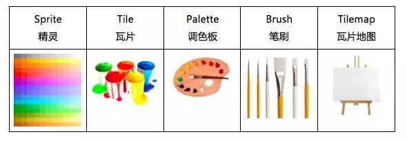
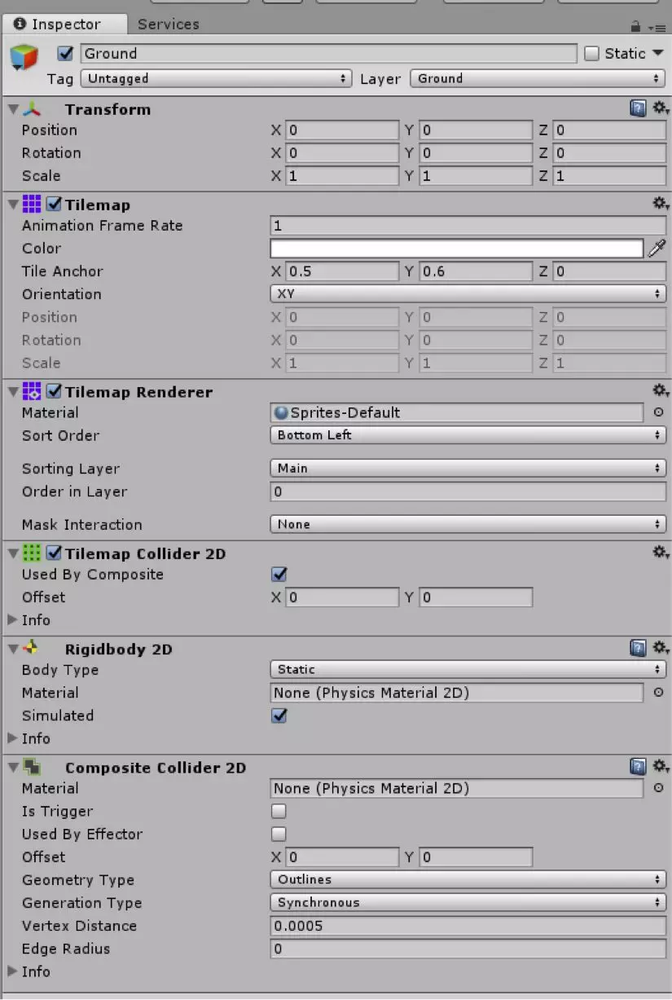
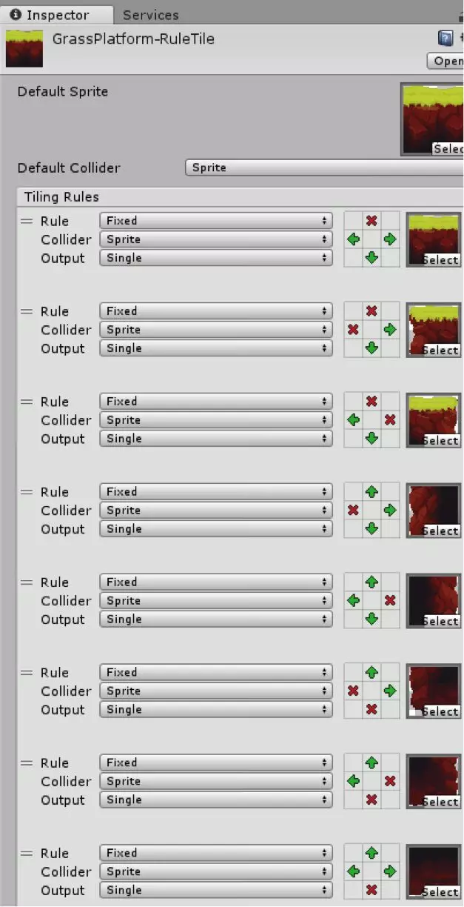

# 0. 瓦片地图基础知识

## 0.1 什么是瓦片地图

**TileMap**是**Unity5.5a实验版**加入的新功能，就像他的字面意思「瓦片地图」。

但说起来这个技术并不“新”了，成熟的2D引擎（诸如gamemaker，RpgMaker），都带有自己自己的tile编辑器的，第三方的编辑工具如Tiled使用起来也是比较方便的，Tile编辑器界的老牌开源编辑器**Tiled**，很多引擎也提供Tiled导入的支持。

TileMap 是有助于快速搭建整体关卡的利器。如果没有它，开发者要么只有用最笨的方法手动逐一搭建，要么自己写编辑器，要么借助于第三方编辑软件，而这三种方法其实对初学者都不是很友好。

## 0.2 瓦片地图的构成

Tilemap用起来其实就和现实中画画一样，它由以下五个基本部分组成：



- Sprite(精灵)：
  纹理的容器。
  大型纹理图集可以转换为精灵图集(Sprite Sheet)。
- Tile(瓦片)：
  包含一个精灵，以及二个属性，颜色和碰撞体类型。
  使用瓦片就像在画布上画画一样，画画时可以设置一些颜色和属性。
- Palette(调色板)：
  当你在画布(Canvas)上画画时，会需要一个位置来保存绘画的结果。
  类似地，调色板(Palette)的功能就是保存瓦片，将它们绘制到网格上。
- Brush(笔刷)：
  用于将画好的东西绘制到画布上。
  使用Tilemap时，可以在多个笔刷中任意选择，绘制出线条、方块等各种形状。
- Tilemap（瓦片地图）：
  类似Photoshop中的图层，我们可以在Tilemap上画上Tile。

Tilemap部分其它工具：

- Grid(网格)：
  用于控制网格属性的组件。
  Tilemap是Grid的子对象。
  Grid类似于UI Canvas(UI画布)。
- Tilemap渲染器(Tilemap Renderer)：
  用于控制Tile在Tilemap上的渲染，控制诸如排序、材质和遮罩等。

# 1.  瓦片地图的初级使用

## 1.1 创建流程

1. 创建瓦片地图：
   在层级窗口中，依次点击Create->2D Object->Tilemap 新建Tilemap
   这将自动创建两个GameObject对象，一个是名为Grid的父对象，上面带有Grid组件。
   另一个是名为Tilemap的子对象，它在Grid对象下，带有Tilemap和Tilemap Renderer组件。
2. 创建调色板
   依次点击Window->Tile Palette打开调色板窗口。
   在调色板窗口中，选择Create New Palette。设置名字和属性，然后指定保存位置。
3. 创建笔刷
   向调色板加入新瓦片，拖动精灵到调色板中，会打开一个新窗口，询问瓦片的保存位置。
   你也可以通过精灵图集拖动多个瓦片。
4. 创建完成，开始在场景中绘制:
   瓦片加入调色板后，就可以用笔刷绘制场景了。

## 1.2 瓦片绘制工具

TilePalette(瓦片调色板) 中可以找到用来绘制Tile的绘图工具：


从左至右依次为：

- 选择工具
  用来选择Tile资源更改属性。
- 移动工具
  用于移动选中的Tile资源。
- 矩形工具
  用于绘制矩形块，并由选定的Tile资源来填充。
- 选取工具
  用于选取要绘制的Tile资源，按下左键并拖拽可以一次选取多个Tile。
- 擦除工具
  用于擦除Tile资源。
- 填充工具
  用于将选定区域填充为选定的Tile资源。

TilePalette面板上有一个Edit，如果选上的话可以编辑在TilePalette面板中的Tile资源。

## 1.3 瓦片地图的物理碰撞

在Tilemap中添加碰撞体十分简单，只要给Tilemap对象加入一个Tilemap Collider 2D组件即可。
可以看到，这个组件自动为该Tilemap上的所有瓦片都加入了碰撞体。

我们可以通过再添加Composite Collider来优化这里的碰撞体，Rigidbody 2D组件会随着Composite Collider自动添加。
因为平台不会移动，所以要记得将Rigidbody 2D上的Body Type属性设置为Static。
最后在Tilemap Collider 2D上勾选Used By Composite，在整个平台周围生成一个复合碰撞体。
设置好后的检视窗口如下所示。



这样我们的Tilemap部分就完成了。

## 1.4 注意事项

### 1.4.1 瓦片匹配问题

- **发生情景：**
  在创建Tilemap及一个palette后，我们想把已有的美术资源(Jungle_Tileset.png)做成瓦片，在对图片进行切片、拖入Palette后、进行绘制地图时会发现，**瓦片并不与Scene场景内的unit单元格匹配**。
  例如下图:


- **问题原因：**
  原因在于我们对图片进行切片时，**Pixels Per Unit** 数值的问题。

- **问题分析：**
  它的含义是**每个unit单元格所能容纳该图片的多少个像素**。上图依次为Pixels Per Unit为不同值时每个瓦片与Scene场景下一个Unit的比例。拿Pixels Per Unit=43来说，其含义是每个unit只够装下43个像素，而我们的美术图片（左）像素为1024x1024，算下来每个瓦片有128像素，我们却只给每个Unit43像素，所以从最右边图片我们可以看出大概9个unit才可以放下一个瓦片。

- **如何解决：**
  对每张将要被做成瓦片的美术资源进行Pixels Per Unit的计算。如本例最合理的数值为 1024/8 = 128

  > 非瓦片的Sprite直接拖拽进入Scene进行缩放操作即可。

### 1.4.2 Tiles的选择问题

- **发生情景：**
  在导入2d-extras包后，我们可以在Project内右键添加各类Tiles（见下图）。假如我们要做一个**带有Animation的瓦片**，是否直接可以直接使用AnimationTile类型呢？答案是肯定的，但完美的做法是按需使用。


- **问题原因：**

  AnimatedTile的RuleTile的功能存在差异

  - AnimatedTile：

    - 瓦片数目：对单块瓦片进行操作
    - 动画速度：MinimumSpeed ~ MaximumSpeed
    - 起始时间：Start Time

  - RuleTile

     

    (前提是设置瓦片output类型为Animation)：

    - 瓦片数目：多片，且能同时实现规则瓦片功能
    - 动画速度：Speed
    - GameObject：同时实现PrefabBrush功能

- **总结：**
  对于带有Animation的瓦片，我们应该**按需选择Tile的类型**。
  例如：不同启用时间的地刺，我们应当选择AnimatedTile进而调节StartTime参数；
  例如：较长的瀑布，我们应该选用RuleTile，既能实现Animation效果又能方便画多个瓦片；
  例如：蜡烛，我们想实现燃烧动画不一致，就应当采用AnimatedTile进而调节两个Speed参数等等。
  但总的来说，**RuleTile集成了几类extra瓦片的基础功能**，较为常用。

### 1.4.3 快捷键

- 旋转绘制中的瓦片的方向：
  [ ] 键
- 删除当前绘制的瓦片：
  按住shift+左键点击

# 2. 瓦片地图 的 API

## 2.1 编辑器中的属性

### 2.1.1 TileMap

tilemap组件是一个存储和处理瓦片资源以便创建2D关卡系统。
此组件将所需信息放置在组件的瓦片上传输到其他相关组件。
例如Tilemap Render和Tilemap Colider2D。

- Animation Frame Rate：
  unity播放图块的速率。（如果将其设置为2，则unity以2倍速度播放Tile动画）
- Color： 
  使用选定的颜色在此Tilemap上为Tile着色。设置为白色时，unity渲染图块时不着色。
- Tile Anchor： 
  Tile在此Tilemap上的锚定偏移。调整位置值以偏移图块 在关联网格上的像元位置。
- Orientation： 
  Tilemap上Tile的方向。如果您需要在特定平面上（特别是在3D视图中）定向图块，使用此项。
- Position： 
  显示当前方向矩阵的位置偏移。
- Rotation： 
  当前方向矩阵的旋转。
- Scale： 
  当前方向矩阵的比例。


### 2.1.2 Tilemap Renderer

- Material： 
  定义用于渲染精灵纹理的材质。
- Sort Order： 
  设置所选瓦片地图上的瓦片排序方向。
- Mode： 
  设置渲染模式。
  - Chunk ：
    渲染器按位置对瓦片进行分组，并将瓦片的精灵一起批处理以进行渲染。可获得最佳渲染性能
  - Individual：
    渲染器单独渲染每个瓦片，同时还会考虑他们的位置和排序顺序。
    此模式使瓦片上的精灵能够与场景中的其他渲染器或与自定义排序轴进行交互

- Detect Chunk Culling Bounds： 
  确定渲染器如何检测用于剔除瓦片地图块的边界。
  这些边界可扩展瓦片地图块的边界，以确保在剔除过程中不会裁剪过大的精灵。
  - Auto：渲染器会自动检查瓦片使用的精灵，以确定要使用的扩展剔除边界
  - Manual：用于扩展边界与剔除瓦片地图块的值是手动设置的，而不使用Editor的自动检测功能

- Chunk Culling Bounds： 
  输入剔除边界的扩展值。

- Sorting Layer： 
  设置瓦片地图的排序图层(sorting layer）。
  从下拉框中选择现有的排序图层，或创建新的排序图层。

- Order in Layer： 
  设置瓦片地图在其排序图层中的渲染优先级。首先渲染编号较低的图层。
  编号较高的图层叠加在前者之上。

- Mask Interaction： 
  设置地图渲染器在于精灵交互时的行为方式。
  - None：
    瓦片地图渲染器不与场景中的任何精灵遮罩交互
  - Visible Inside Mask：
    瓦片地图在精灵遮罩覆盖瓦片地图的地方是可见的，而在遮罩外部不可见
  - Visible Outside Mask：
    瓦片地图在精灵遮罩外部是不可见的，而在遮罩内部不可见。
    精灵遮罩会隐藏其要覆盖的精灵部分


## 2.2 编程用API

https://docs.unity.cn/cn/current/ScriptReference/Tilemaps.Tilemap.html

### 2.2.1 Tilemap

#### 常用变量

| 变量名称                                                     | 作用                                                 |
| ------------------------------------------------------------ | ---------------------------------------------------- |
| [Grid](https://docs.unity3d.com/cn/2021.2/ScriptReference/Grid.html) [layoutGrid](https://docs.unity3d.com/cn/2021.2/ScriptReference/Tilemaps.Tilemap-layoutGrid.html) | 获取与此Tilemap关联的网格。                          |
| [BoundsInt](https://docs.unity3d.com/cn/2021.2/ScriptReference/BoundsInt.html) [localBounds](https://docs.unity3d.com/cn/2021.2/ScriptReference/Tilemaps.Tilemap-localBounds.html) | 以本地空间大小返回 Tilemap 的边界。                  |
| [BoundsInt](https://docs.unity3d.com/cn/2021.2/ScriptReference/BoundsInt.html) [cellBounds](https://docs.unity3d.com/cn/2021.2/ScriptReference/Tilemaps.Tilemap-cellBounds.html) | 以单元格大小返回 Tilemap 的边界。                    |
| Vector3Int origin                                            | Tilemap 的原点（以单元格位置为单位）。               |
| [Vector3Int](https://docs.unity3d.com/cn/2021.2/ScriptReference/Vector3Int.html) [size](https://docs.unity3d.com/cn/2021.2/ScriptReference/Tilemaps.Tilemap-size.html) | Tilemap 的大小（以单元格为单位）。                   |
| Vector3 [tileAnchor](https://docs.unity3d.com/cn/2021.2/ScriptReference/Tilemaps.Tilemap-tileAnchor.html) | Tilemap 的锚点。                                     |
| [orientation](https://docs.unity3d.com/cn/2021.2/ScriptReference/Tilemaps.Tilemap-orientation.html) | Tilemap 的排列方向。                                 |
| bool enabled                                                 | 启用的 Behaviour 可更新，禁用的 Behaviour 不可更新。 |
| Vector3 [cellGap](https://docs.unity3d.com/cn/2021.2/ScriptReference/GridLayout-cellGap.html) | 布局中各个单元格之间的间隙大小。                     |
| [cellLayout](https://docs.unity3d.com/cn/2021.2/ScriptReference/GridLayout-cellLayout.html) | 单元格的布局。                                       |
| [cellSize](https://docs.unity3d.com/cn/2021.2/ScriptReference/GridLayout-cellSize.html) | 布局中每个单元格的大小。                             |
| [cellSwizzle](https://docs.unity3d.com/cn/2021.2/ScriptReference/GridLayout-cellSwizzle.html) | 布局的单元格重排。                                   |
| [hideFlags](https://docs.unity3d.com/cn/2021.2/ScriptReference/Object-hideFlags.html) | 该对象应该隐藏、随场景一起保存还是由用户修改？       |
| [Color](https://docs.unity3d.com/cn/2021.2/ScriptReference/Color.html) [color](https://docs.unity3d.com/cn/2021.2/ScriptReference/Tilemaps.Tilemap-color.html) | Tilemap 层的颜色                                     |

#### 常用方法

##### 添加瓦片

- [SetTile](https://docs.unity3d.com/cn/2021.2/ScriptReference/Tilemaps.Tilemap.SetTile.html)
  在Tilemap中指定的单元格添加瓦片。 
  `void SetTile (Vector3Int position, Tilemaps.TileBase tile); `

- [SetTiles](https://docs.unity3d.com/cn/2021.2/ScriptReference/Tilemaps.Tilemap.SetTiles.html)
  在Tilemap中指定的一组单元格添加一组瓦片。
  `void SetTiles(Vector3Int[] positionArray, TileBase[] tileArray);`

- [SetTilesBlock](https://docs.unity3d.com/cn/2021.2/ScriptReference/Tilemaps.Tilemap.SetTilesBlock.html)
  在Tilemap中指定的一个范围块内添加一组瓦片。
  ` void SetTilesBlock(BoundsInt position, TileBase[] tileArray);`

  > 比SetTiles更有效率，是批处理

- [BoxFill](https://docs.unity.cn/cn/current/ScriptReference/Tilemaps.Tilemap.BoxFill.html)
  在瓦片地图上使用给定瓦片进行框填。
  从给定坐标开始，然后从开始到结束（含）填充边界。
  `void BoxFill (Vector3Int position, Tilemaps.TileBase tile, int startX, int startY, int endX, int endY);`

  | 参数名   | 含义                                                         |
  | -------- | ------------------------------------------------------------ |
  | position | 瓦片在 [Tilemap](https://docs.unity.cn/cn/current/ScriptReference/Tilemaps.Tilemap.html) 上的位置。 |
  | tile     | 要放置的 [Tile](https://docs.unity.cn/cn/current/Manual/Tilemap-ScriptableTiles-TileBase.html)。 |
  | startX   | 填充范围的 X 坐标下限。                                      |
  | startY   | 填充范围的 Y 坐标下限。                                      |
  | endX     | 填充范围的 X 坐标上限。                                      |
  | endY     | 填充范围的 Y 坐标上限。                                      |

- [FloodFill](https://docs.unity.cn/cn/current/ScriptReference/Tilemaps.Tilemap.FloodFill.html)
  从给定坐标开始，在瓦片地图上使用要放置的给定瓦片进行灌填(油漆桶)。
  `void FloodFill (Vector3Int position, Tilemaps.TileBase tile);`

  > BoxFill是范围内填充
  > FloodFill是剩下范围全部填充

- [InsertCells](https://docs.unity3d.com/cn/2021.2/ScriptReference/Tilemaps.Tilemap.InsertCells.html)
  在Tilemap中指定位置插入很多瓦片
  `void InsertCells (Vector3Int position, Vector3Int insertCells);`
  参数:

  - position 单元格坐标
  - Vector3Int insertCells 插入瓦片参数
    -  numColumns：插入列数
    -  numRows：插入行数
    -  numLayers：插入层数

##### 查询瓦片

- [GetTile](https://docs.unity3d.com/cn/2021.2/ScriptReference/Tilemaps.Tilemap.GetTile.html)
  获取指定单元格的瓦片对象。
  ` Tilemaps.TileBase GetTile(Vector3Int position);`
- [GetSprite](https://docs.unity3d.com/cn/2021.2/ScriptReference/Tilemaps.Tilemap.GetSprite.html)
  获取指定单元格的瓦片使用的精灵对象。
  ` Sprite GetSprite(Vector3Int position);`
- [ContainsTile](https://docs.unity3d.com/cn/2021.2/ScriptReference/Tilemaps.Tilemap.ContainsTile.html)
  瓦片地图中是否存在该瓦片
  `bool ContainsTile(TileBase tileAsse);`
- [HasTile](https://docs.unity3d.com/cn/2021.2/ScriptReference/Tilemaps.Tilemap.HasTile.html)
  瓦片地图的指定位置是否存在该瓦片
  ` bool HasTile(Vector3Int position);`
- [GetCellCenterLocal](https://docs.unity.cn/cn/current/ScriptReference/Tilemaps.Tilemap.GetCellCenterLocal.html)
  获取瓦片地图逻辑中心的本地坐标。
  `Vector3 GetCellCenterLocal (Vector3Int position);`
- [GetCellCenterWorld](https://docs.unity.cn/cn/current/ScriptReference/Tilemaps.Tilemap.GetCellCenterWorld.html)
  获取瓦片地图逻辑中心的世界坐标。
  `Vector3 GetCellCenterWorld (Vector3Int position);`
- [GetColliderType](https://docs.unity.cn/cn/current/ScriptReference/Tilemaps.Tilemap.GetColliderType.html)
  根据给定的瓦片地图中某个单元格的 XYZ 坐标，获取瓦片的碰撞体类型。
  `Tilemaps.Tile.ColliderType GetColliderType (Vector3Int position);`
- [GetColor](https://docs.unity.cn/cn/current/ScriptReference/Tilemaps.Tilemap.GetColor.html)
  根据给定的瓦片地图中某个单元格的 XYZ 坐标，获取瓦片的颜色。
  `Color GetColor (Vector3Int position);`
- [GetTileFlags](https://docs.unity.cn/cn/current/ScriptReference/Tilemaps.Tilemap.GetTileFlags.html)
  获取给定位置处的 Tile 的 TileFlags。
  `Tilemaps.TileFlags GetTileFlags (Vector3Int position);`
- [GetUsedTilesCount](https://docs.unity.cn/cn/current/ScriptReference/Tilemaps.Tilemap.GetUsedTilesCount.html)
  获取 Tilemap 中使用的不同 tiles 的总数。
  `int GetUsedTilesCount ();`

##### 修改瓦片

- [SetColliderType](https://docs.unity.cn/cn/current/ScriptReference/Tilemaps.Tilemap.SetColliderType.html)
  根据给定的瓦片地图中某个单元格的 XYZ 坐标，设置瓦片的碰撞体类型。
  `void SetColliderType (Vector3Int position, Tilemaps.Tile.ColliderType colliderType);`
- [SetColor](https://docs.unity.cn/cn/current/ScriptReference/Tilemaps.Tilemap.SetColor.html)
  根据给定的瓦片地图中某个单元格的 XYZ 坐标，设置瓦片的颜色。
  `void SetColor (Vector3Int position, Color color);`
- [SetTileFlags](https://docs.unity.cn/cn/current/ScriptReference/Tilemaps.Tilemap.SetTileFlags.html)
  将 TileFlags 设置到给定位置处的 Tile 上。
  `void SetTileFlags (Vector3Int position, Tilemaps.TileFlags flags);`

##### 更新瓦片

- [RefreshTile](https://docs.unity3d.com/cn/2021.2/ScriptReference/Tilemaps.Tilemap.RefreshTile.html)
  更新指定位置的瓦片。
  `void RefreshTile(Vector3Int position);`
- [RefreshAllTiles](https://docs.unity3d.com/cn/2021.2/ScriptReference/Tilemaps.Tilemap.RefreshAllTiles.html)
  更新瓦片地图中的所有瓦片。
  `void RefreshAllTiles ();`
- [SwapTile](https://docs.unity3d.com/cn/2021.2/ScriptReference/Tilemaps.Tilemap.SwapTile.html)
  将所有指定类型的瓦片置换为新的瓦片对象并刷新
  `void SwapTile(Tilemaps.TileBase changeTile, Tilemaps.TileBase newTile);`
  - changeTile：旧瓦片
  - newTile：新瓦片

##### 删除瓦片

- [ClearAllTiles](https://docs.unity3d.com/cn/2021.2/ScriptReference/Tilemaps.Tilemap.ClearAllTiles.html)
  清除瓦片地图内所有瓦片。
  `void ClearAllTiles();`
- [DeleteCells](https://docs.unity3d.com/cn/2021.2/ScriptReference/Tilemaps.Tilemap.DeleteCells.html)
  删除指定范围内的瓦片
  `void DeleteCells(Vector3Int position, Vector3Int deleteCells);`
  Vector3Int deleteCells:
  - 列数
  - 行数
  - 层级

##### 坐标转换

- [CellToLocal](https://docs.unity3d.com/cn/2021.2/ScriptReference/GridLayout.CellToLocal.html)
  将单元格位置转换为本地空间位置。
  ` Vector3 CellToLocal(Vector3Int cellPosition);`
- [CellToWorld](https://docs.unity3d.com/cn/2021.2/ScriptReference/GridLayout.CellToWorld.html)
  将单元格位置转换为世界空间位置。
  `Vector3 CellToWorld (Vector3Int cellPosition);`
- [LocalToCell](https://docs.unity3d.com/cn/2021.2/ScriptReference/GridLayout.LocalToCell.html)
  将本地位置转换为单元格位置。
  `Vector3Int LocalToCell (Vector3 localPosition);`
- [WorldToCell](https://docs.unity3d.com/cn/2021.2/ScriptReference/GridLayout.WorldToCell.html)
  将世界位置转换为单元格位置。
  ` Vector3Int WorldToCell (Vector3 worldPosition);`
- [GetBoundsLocal](https://docs.unity3d.com/cn/2021.2/ScriptReference/GridLayout.GetBoundsLocal.html)
  返回该位置的单元格的本地边界。
  `Bounds GetBoundsLocal (Vector3Int cellPosition);`
- [GetLayoutCellCenter](https://docs.unity3d.com/cn/2021.2/ScriptReference/GridLayout.GetLayoutCellCenter.html)
  获取 Grid 的设置布局的单元格默认中心坐标(世界坐标)。
  `Vector3 GetLayoutCellCenter ();`

**注意**：
所有坐标转换方法都是依赖于tilemap实例的父实例([GridLayout](https://docs.unity3d.com/cn/2021.2/ScriptReference/GridLayout.html))
需要如下方法才能使用：

```c#
GridLayout gridLayout = transform.parent.GetComponent<GridLayout>();
Vector3Int cellPosition = gridLayout.LocalToCell(transform.localPosition);
transform.localPosition = gridLayout.CellToLocal(cellPosition);
```

### 2.2.2 Tile

Tilemap 中默认瓦片的类。

该类从 TileBase 继承，代表将放置在 Tilemap 中的默认瓦片。它实现 TileBase.GetTileData，以在瓦片地图中简单渲染 Sprite。

#### 常用变量

| 变量名                                                       | 作用                        |
| ------------------------------------------------------------ | --------------------------- |
| [color](https://docs.unity.cn/cn/current/ScriptReference/Tilemaps.Tile-color.html) | Tile 的 颜色。              |
| [flags](https://docs.unity.cn/cn/current/ScriptReference/Tilemaps.Tile-flags.html) | Tile 的 TileFlags。         |
| [gameObject](https://docs.unity.cn/cn/current/ScriptReference/Tilemaps.Tile-gameObject.html) | Tile 的 GameObject。        |
| [sprite](https://docs.unity.cn/cn/current/ScriptReference/Tilemaps.Tile-sprite.html) | 要在 Tile 处渲染的 Sprite。 |
| [transform](https://docs.unity.cn/cn/current/ScriptReference/Tilemaps.Tile-transform.html) | Tile 的 Transform matrix。  |

> 注意：
> transform是矩阵，不是一般游戏对象的transform组件

以上五个属性合一块一封装就是[TileData](https://docs.unity.cn/cn/current/ScriptReference/Tilemaps.TileData.html)了

#### 常用方法

- [GetTileData](https://docs.unity.cn/cn/current/ScriptReference/Tilemaps.Tile.GetTileData.html)
  检索 Tile 的瓦片渲染数据。
  `void GetTileData (Vector3Int position, Tilemaps.ITilemap tilemap, ref Tilemaps.TileData tileData);`
- [RefreshTile](https://docs.unity.cn/cn/current/ScriptReference/Tilemaps.TileBase.RefreshTile.html)
  瓦片刷新时调用
  `void RefreshTile (Vector3Int position, Tilemaps.ITilemap tilemap);`

> 注意：
> 以上俩方法都是静态方法，不能通过实例调用，要通过类名调用

### 2.2.3 编程案例

使用程序动态生成使用三种瓦片的瓦片地图

**瓦片种类有三种：**


代码如下:

**瓦片地图生成：**

```c#
using UnityEngine;
using UnityEngine.Tilemaps;

public class MapSystem : MonoBehaviour
{
    public Vector2Int mapSize;//瓦片地图大小
    public float desertRate = 0.2f;//沙漠地块所占比例
    public float gobiRate = 0.4f;//戈壁地块所占比例
    public float oasisRate = 0.4f;//绿洲地块所占比例
    public int mixingAreaSize = 2;//交接混合地块宽度

    private LandBlock[][] landBlocks;
    private Tilemap tilemap;

    void Awake()=> tilemap = gameObject.GetComponent<Tilemap>();
    void Start() => initMap();

    public void initMap()//初始化地图
    {
        tilemap.ClearAllTiles();//先清空瓦片地图中的所有瓦片
        tilemap.size = new Vector3Int(mapSize.x,mapSize.y,0);//设置瓦片地图大小
        landBlocks = new LandBlock[mapSize.y][];//准备数据结构与瓦片地图的瓦片绑定
        GridLayout gridLayout = transform.parent.GetComponentInParent<GridLayout>();//获取瓦片地图的父对象，网格布局
		
        //求三种地块(瓦片)所占的列数
        int desertCol = (int) (mapSize.x * desertRate);
        int gobiCol = (int)(mapSize.x * gobiRate);
        int oasisCol = mapSize.x - desertCol - gobiCol;
		
        //开始生成瓦片地图
        for (int i = 0;i<mapSize.y;i++)
        {
            landBlocks[i] = new LandBlock[mapSize.x];
            for (int j = 0;j<mapSize.x;j++)
            {
                // 初始化瓦片
                Tile tile = ScriptableObject.CreateInstance<Tile>();
                // 初始化瓦片单元格地址(逻辑地址)
                Vector3Int index = new Vector3Int(i, j, 0);
                // 将瓦片添加到瓦片地图中
                tilemap.SetTile(index, tile);
                // 获取该瓦片的世界坐标
                Vector3 position = gridLayout.CellToWorld(index);
                
                // 根据当前列数生成地块(地块数据与瓦片绑定)
                LandBlock landBlock;
                if(j < desertCol - mixingAreaSize)
                    landBlock = new LandBlock(index, position, LandBlock.BlockType.Desert, tile);
                else if(j < desertCol)
                    if(Random.Range(0f, 1f) < 0.5)
                        landBlock = new LandBlock(index, position, LandBlock.BlockType.Desert, tile);
                    else
                        landBlock = new LandBlock(index, position, LandBlock.BlockType.Gobi, tile);
                
                else if(j < desertCol + gobiCol - mixingAreaSize)
                    landBlock = new LandBlock(index, position, LandBlock.BlockType.Gobi, tile);
                else if(j < desertCol + gobiCol)
                    if (Random.Range(0f, 1f) < 0.5)
                        landBlock = new LandBlock(index, position, LandBlock.BlockType.Gobi, tile);
                    else
                        landBlock = new LandBlock(index, position, LandBlock.BlockType.Oasis, tile);
                
                else
                    landBlock = new LandBlock(index, position, LandBlock.BlockType.Oasis, tile);
                
                landBlocks[i][j] = landBlock;
            }
        }
        // 更新瓦片地图的所有瓦片，地图初始化完成
        tilemap.RefreshAllTiles();
    }
```

**地块数据类:**

```c#
using System.Collections.Generic;
using UnityEngine;
using UnityEngine.Tilemaps;

public class LandBlock
{
    private static readonly List<Sprite> spriteList = new List<Sprite>(Resources.LoadAll<Sprite>("img/Entity/LandBlocks"));
    public enum BlockType { Desert, Gobi, Oasis };// 地块类型: 沙漠，戈壁，绿洲

    public Vector3Int index;   // 逻辑坐标
    public Vector3 position; // 位置
    public Tile tile;

    private BlockType type;
    public BlockType Type {get => type;}

    public LandBlock(Vector3Int index, Vector3 position, BlockType type, Tile tile)
    {
        this.index = index;
        this.position = position;
        this.type = type;
        this.tile = tile;
        setSprite();
    }
    
    private void setSprite()//更改瓦片精灵
    {
        string spriteName = type.ToString() + "Block";
        tile.sprite = spriteList.Find(p => p.name == spriteName);
    }
}
```

> 注意：
> Tile 瓦片的实例化不能使用new，会报错。
> 需要使用 ScriptableObject.CreateInstance 才行，例如:
> Tile tile = ScriptableObject.CreateInstance<Tile>();

**效果如下:**


这样就可以程序化生成地图了

# 3. 2d-extras中的高级瓦片

https://github.com/Unity-Technologies/2d-extras

为了提高开发速度，Unity创建了名为2d-extras的GitHub代码库，这里面的工具都是基于Tilemap制作，有很多实用的瓦片和笔刷，下面介绍几个2d-extras中的实用工具。

## 3.1 规则瓦片(Rule Tile)

2d-extras中最重要的工具之一就是规则瓦片(Rule Tile)。



不用这个工具的话，我们每次在Tilemap上绘制时，都要从调色板选取特定瓦片再进行绘制。
如果你想要绘制相邻瓦片，例如一个拐角，你需要从调色板上一次次选取不同瓦片进行绘制。这种方法效率不高。但有了规则瓦片，你可以为相邻瓦片设置一组规则，它将自动选择最合适的瓦片进行绘制。

**规则瓦片属性：**


规则图块属性包括：

- **默认精灵**
- **默认游戏对象**：
  可以保留为空白
- **默认碰撞器**：
  指定了瓦片的碰撞检测模式，有两种:
  - 精灵模式:按精灵形状进行碰撞检测
  - 网格模式:按瓦片地图的单元网格形状进行碰撞检测

您添加的每个磁贴都有其他属性：

- **Rule** ：
  这决定了规则的类型。选项是**固定**（默认行为）、**镜像**（跨 X 或 Y 轴）或**旋转**。镜像和旋转是指 3x3 网格的配置，本节稍后会详细介绍。


上图的两个 Rotated 规则完成了 8 个 设定瓦片规则的工作。

- **游戏对象**
- **碰撞器**：
  更改特定图块的碰撞器以覆盖默认碰撞器。
- **输出**：
  这决定了瓷砖如何放置到场景中。
  您可以从**Single** 、**Random**或**Animation 中进行选择**。
  - Single ：单个瓦片(普通瓦片)。将使用选定的瓦片。
  - Random：随机瓦片。将在一组定义的瓦片之间进行选择
  - Animation ：动画瓦片。将播放指定图块的动画。
- **3x3 网格**：
  用于设定规则，规则可以根据周围瓦片的属性来决定中心瓦片的属性
  比如说地块的拼接和转交等功能
- **瓦片选择**：
  在该规则下使用的瓦片

## 3.2 预制件笔刷

在2d-extras中，还加入了预制件笔刷(Prefab Brush)。它能用预制件而不是瓦片来绘制画面。预制件可以是3D对象、粒子效果或是动画对象。要想创建自己的预制件笔刷，只要在项目窗口点击Create -> Prefab Brush即可。然后选取刚创建的预制件笔刷，指定想要画出的预制件。如果你添加了不止一个预制件，它会在这些预制件中随机选取进行绘制。

# 4. 相关参考

https://zhuanlan.zhihu.com/p/34714804

https://www.cnblogs.com/SouthBegonia/p/11592554.html
